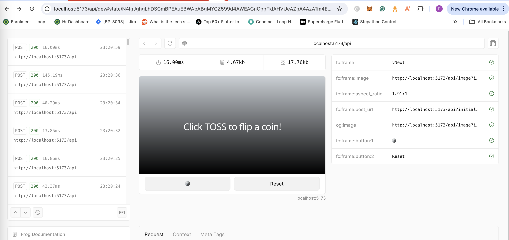
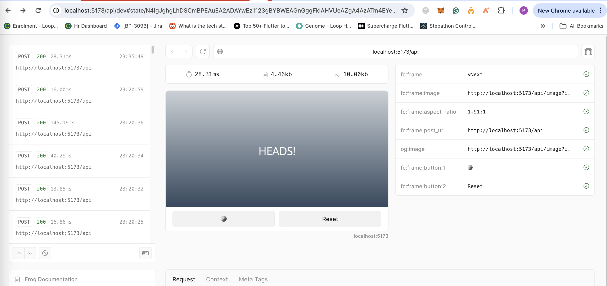
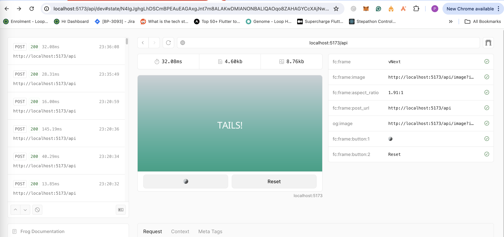

# First Frame example: 
Flipping Coin 

## Images: 
 <!-- // add image from /local image.png -->



```
npm install
npm run dev
```

Head to http://localhost:5173/api

Roadmap : 
* add coin flip animations
* all score tracking onchain